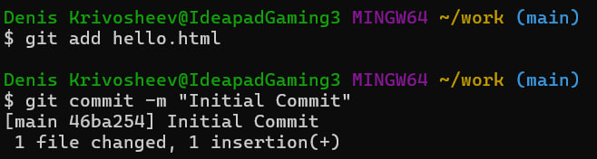
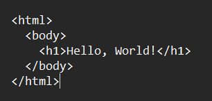
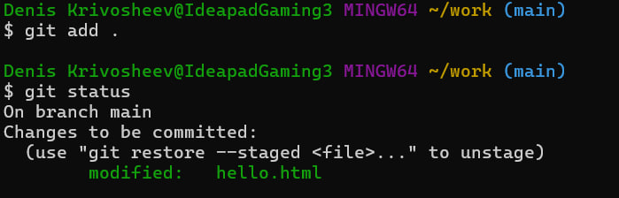
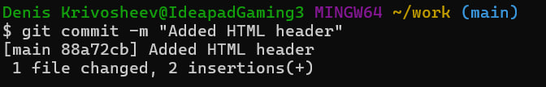
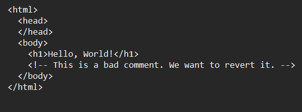
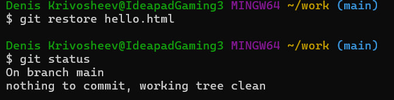
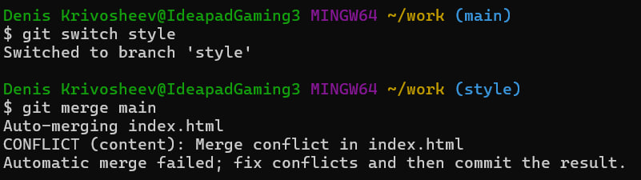
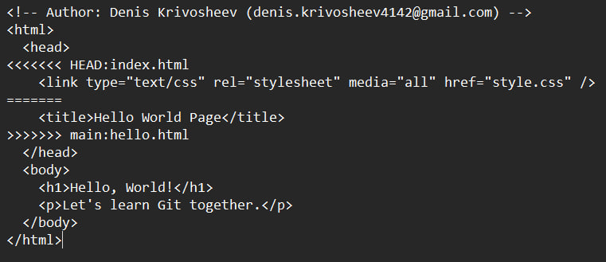
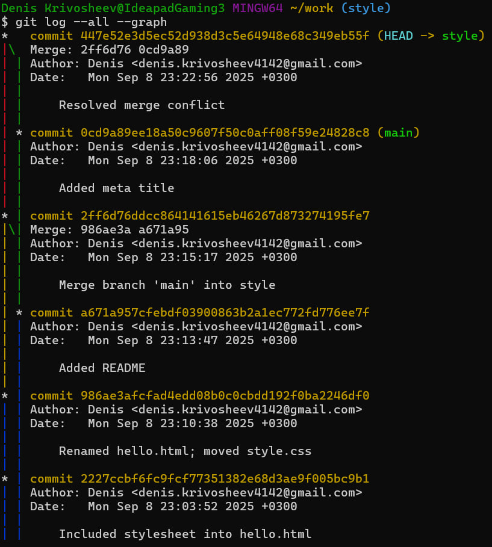
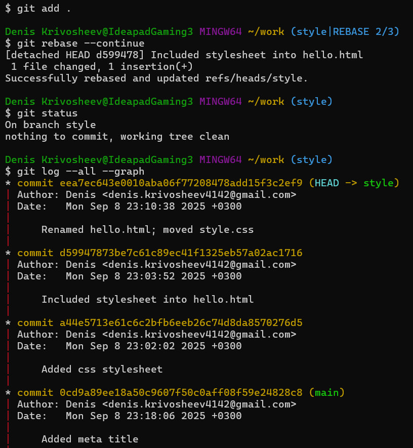

# ui-ux_Git_-1
# Звіт – Практичне заняття №1  
**Тема:** Проходження інтерактивного курсу «Git How To»  

## Виконане завдання
У межах практичного заняття було пройдено інтерактивний курс [Git How To](https://githowto.com/uk), який дозволяє закріпити базові та розширені навички роботи з системою контролю версій Git у консольному середовищі.  

### Рівень проходження (Частина 1)
- ✅ **Частина 1** (базові операції):  
  - ініціалізація репозиторію  
  - додавання та коміти файлів  
  - перегляд історії  
  - скасування змін  
  - робота з гілками
### Висновок
Під час роботи вдалося засвоїти основні команди Git: створення репозиторію, додавання файлів і створення комітів, перегляд історії, відкат змін та опрацювання гілок.
## Скріншоти роботи:
## 1.1

## 1.2

## 1.3

## 2.1

## 2.2

## 2.3

## 3.1

## 4.1

## 4.2

## 5.1

## 7.1.1

## 7.1.2

## 7.2

## 8.1

## 8.2

## 8.3

## 8.4

## 8.5

## 8.6

## 8.7

## 9.1

## 9.2

## 9.3

## 9.4

## 10.1.1

## 10.1.2

## 10.2

## 11.1

## 11.2.1

## 11.2.2

## 11.3

## 11.4

## 11.5

## 12.1

## 12.2

## 12.3

## 12.4

## 13.1.1

## 13.1.2

## 13.2

## 13.3

## 13.4

## 14.2.1

## 14.2.2

## 14.3

## 14.4

## 15.3

## 15.4

## 15.5

## 16.1

## 17.1.1

## 17.1.2

## 17.2

## 17.3

## 17.4

## 18.1

## 18.2.1

## 18.2.2

## 18.2.3

## 18.3.1

## 18.3.2

## 19.1

## 19.2

## 20.1.1

## 20.1.2

## 20.2

## 20.3.1

## 20.3.2

## 20.4.1

## 20.4.2

## 21.2

## 22.2

## 23.1

## 24.1.1

## 24.1.2

## 24.2

## 25.1.1

## 25.1.2

## 25.1.3

## 25.2

## 25.3.1

## 25.3.2

## 25.4.1

## 25.4.2

## 27.1.2

## 27.2

## 28.1.1

## 28.1.2

## 28.2.1

## 28.2.2

## 28.2.3

## 29.1

## 29.2

